# Stokify

**Aplikasi Manajemen Inventaris Gudang Berbasis Android**

[](https://kotlinlang.org)
[](https://developer.android.com)
[](https://developer.android.com/training/data-storage/room)
[](LICENSE)

---

## Deskripsi Aplikasi

**Stokify** adalah aplikasi Android untuk manajemen inventaris gudang yang dirancang untuk membantu pemilik toko dan staff dalam mengelola stok produk secara efisien. Aplikasi ini menyediakan fitur lengkap mulai dari pencatatan produk, monitoring stok, hingga pembuatan laporan.

### Target Pengguna
- **Admin/Pemilik Toko**: Akses penuh (CRUD produk, lihat aset, export laporan)
- **Staff**: Akses terbatas (lihat katalog, update stok)

---

## Fitur Utama

### Authentication
- Login & Register dengan Room Database
- Session management menggunakan DataStore Preferences
- Role-based access (Admin/Staff)

### Dashboard
- Statistik stok (Habis/Menipis/Aman)
- Total produk, kategori, dan nilai aset
- Daftar produk yang perlu restock

### Manajemen Produk
- CRUD produk lengkap (Create, Read, Update, Delete)
- 20 data awal produk (pre-populated)
- Search, filter by kategori, sort (nama/harga/stok)
- Upload gambar dari Gallery atau Camera
- Detail produk dengan riwayat stok

### Stok Management
- Stock IN/OUT dengan catatan riwayat
- Status stok otomatis (Habis/Menipis/Aman)
- Peringatan stok di bawah minimum

### Laporan
- Pie Chart status stok
- Bar Chart produk per kategori
- Horizontal Bar top 5 stok terendah
- Export ke PDF dan CSV

### UI/UX
- Material Design 3
- Dark Mode support
- Splash Screen API
- Bottom Navigation
- Form validation lengkap

---

## Tech Stack

| Komponen | Teknologi |
|----------|-----------|
| Bahasa | Kotlin |
| Database | Room (Android Jetpack) |
| Architecture | Repository Pattern + ViewModel |
| State Management | StateFlow |
| UI | Material Design 3 + ViewBinding |
| Navigation | Navigation Component + Bottom Navigation |
| Session | DataStore Preferences |
| Charts | MPAndroidChart |
| Export | iTextPDF + OpenCSV |

---

## Struktur Project

```
app/src/main/java/com/uas202404021/stokify/
├── data/
│   ├── local/
│   │   ├── dao/
│   │   │   ├── ProductDao.kt
│   │   │   ├── UserDao.kt
│   │   │   └── StockHistoryDao.kt
│   │   ├── db/
│   │   │   ├── AppDatabase.kt
│   │   │   ├── ProductEntity.kt
│   │   │   ├── UserEntity.kt
│   │   │   └── StockHistoryEntity.kt
│   │   └── pref/
│   │       └── SessionManager.kt
│   └── repository/
│       └── AppRepository.kt
├── domain/
│   └── usecase/
│       ├── ValidateAuthUseCase.kt
│       └── ValidateProductUseCase.kt
├── presentation/
│   ├── adapter/
│   │   ├── ProductAdapter.kt
│   │   ├── HistoryAdapter.kt
│   │   └── WarningProductAdapter.kt
│   ├── ui/
│   │   ├── MainActivity.kt
│   │   ├── SplashActivity.kt
│   │   ├── auth/
│   │   │   ├── LoginActivity.kt
│   │   │   └── RegisterActivity.kt
│   │   ├── dashboard/
│   │   │   └── DashboardFragment.kt
│   │   ├── inventory/
│   │   │   ├── InventoryListFragment.kt
│   │   │   ├── ProductDetailFragment.kt
│   │   │   └── AddEditProductFragment.kt
│   │   ├── profile/
│   │   │   └── ProfileFragment.kt
│   │   └── report/
│   │       └── ReportFragment.kt
│   └── viewmodel/
│       ├── AuthViewModel.kt
│       ├── InventoryViewModel.kt
│       └── ReportViewModel.kt
└── util/
    ├── CsvExporter.kt
    └── PdfGenerator.kt
```

---

## Entity Relationship Diagram (ERD)

```
┌─────────────────────┐     ┌─────────────────────────┐     ┌──────────────────────┐
│       users         │     │        products         │     │    stock_history     │
├─────────────────────┤     ├─────────────────────────┤     ├──────────────────────┤
│ id (PK)             │     │ id (PK)                 │     │ id (PK)              │
│ fullName            │     │ sku                     │     │ productId (FK)       │
│ username            │     │ name                    │     │ changeAmount         │
│ password            │     │ category                │     │ type (IN/OUT)        │
│ role (Admin/Staff)  │     │ stock                   │     │ timestamp            │
└─────────────────────┘     │ minStock                │     └──────────────────────┘
                            │ price                   │
                            │ imageUri                │
                            │ location                │
                            └─────────────────────────┘
```

---

## Room Database

### Entities

#### 1. UserEntity
Menyimpan data pengguna aplikasi.

| Field | Type | Keterangan |
|-------|------|------------|
| id | Int (PK) | Auto-generated |
| fullName | String | Nama lengkap |
| username | String | Username unik |
| password | String | Hashed password |
| role | String | Admin/Staff |

#### 2. ProductEntity
Menyimpan data produk inventaris.

| Field | Type | Keterangan |
|-------|------|------------|
| id | Int (PK) | Auto-generated |
| sku | String | Kode SKU unik |
| name | String | Nama produk |
| category | String | Kategori produk |
| stock | Int | Stok saat ini |
| minStock | Int | Stok minimum |
| price | Double | Harga satuan |
| imageUri | String? | Path gambar |
| location | String | Lokasi di gudang |

#### 3. StockHistoryEntity
Menyimpan riwayat perubahan stok.

| Field | Type | Keterangan |
|-------|------|------------|
| id | Int (PK) | Auto-generated |
| productId | Int (FK) | Relasi ke product |
| changeAmount | Int | Jumlah perubahan |
| type | String | IN/OUT |
| timestamp | Long | Waktu perubahan |

---

## Screenshots

<table>
  <tr>
    <td align="center"><b>Splash Screen</b></td>
    <td align="center"><b>Login</b></td>
    <td align="center"><b>Register</b></td>
  </tr>
  <tr>
    <td>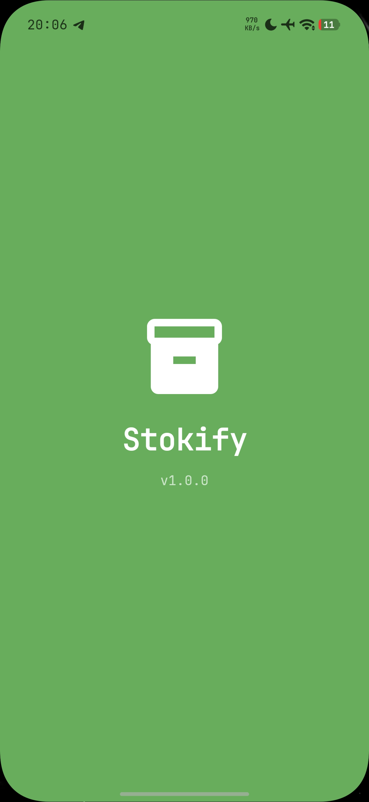</td>
    <td>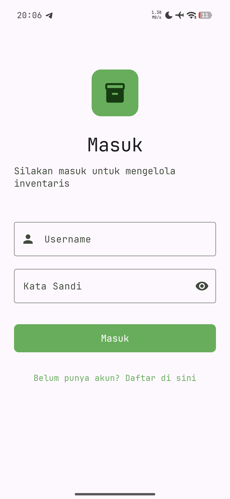</td>
    <td>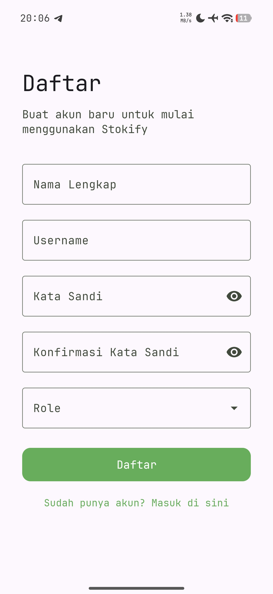</td>
  </tr>
  <tr>
    <td align="center"><b>Dashboard Admin</b></td>
    <td align="center"><b>Dashboard Staff</b></td>
    <td align="center"><b>Katalog Admin</b></td>
  </tr>
  <tr>
    <td>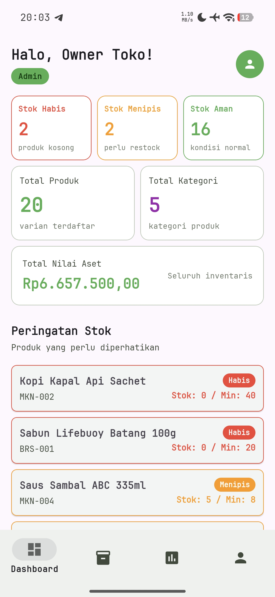</td>
    <td>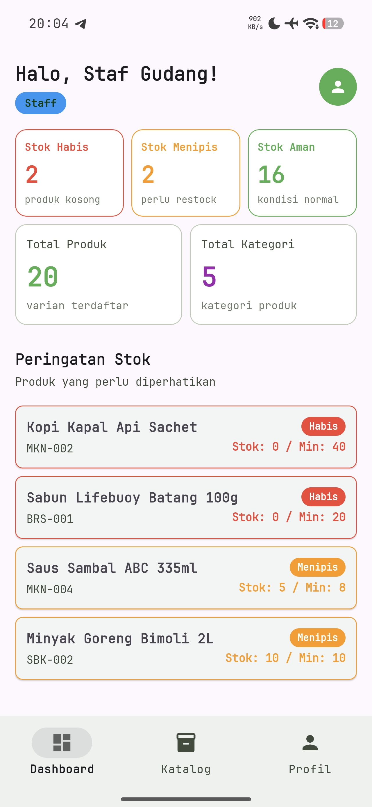</td>
    <td>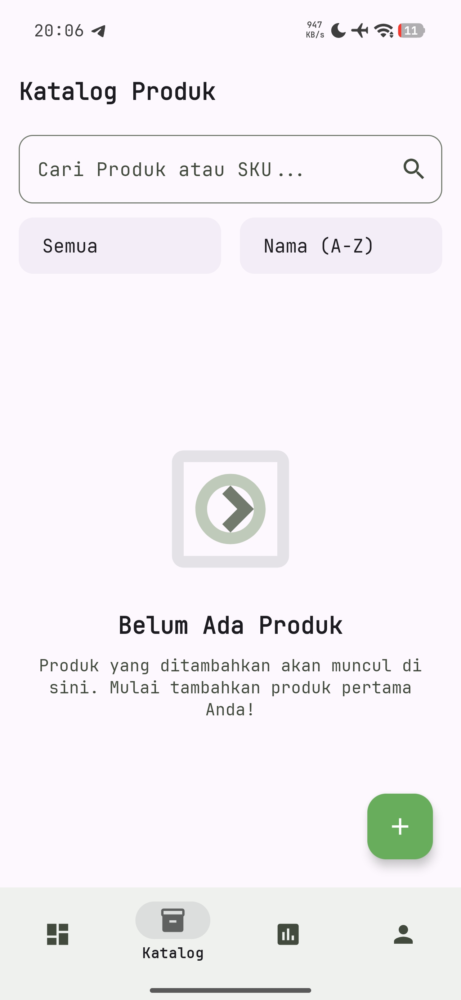</td>
  </tr>
  <tr>
    <td align="center"><b>Katalog Staff</b></td>
    <td align="center"><b>Detail Produk (Habis)</b></td>
    <td align="center"><b>Detail Produk (Menipis)</b></td>
  </tr>
  <tr>
    <td>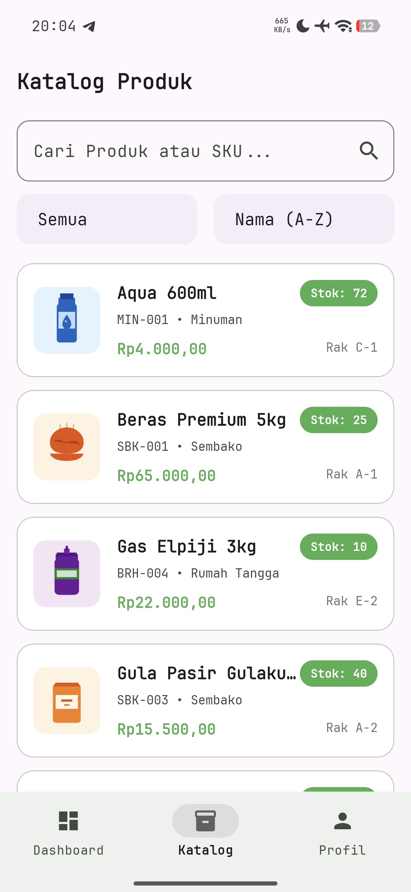</td>
    <td>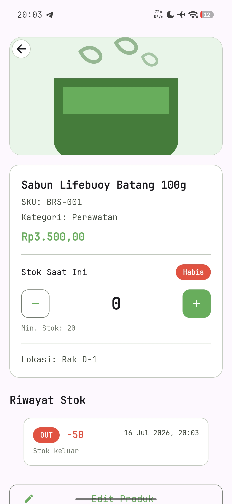</td>
    <td>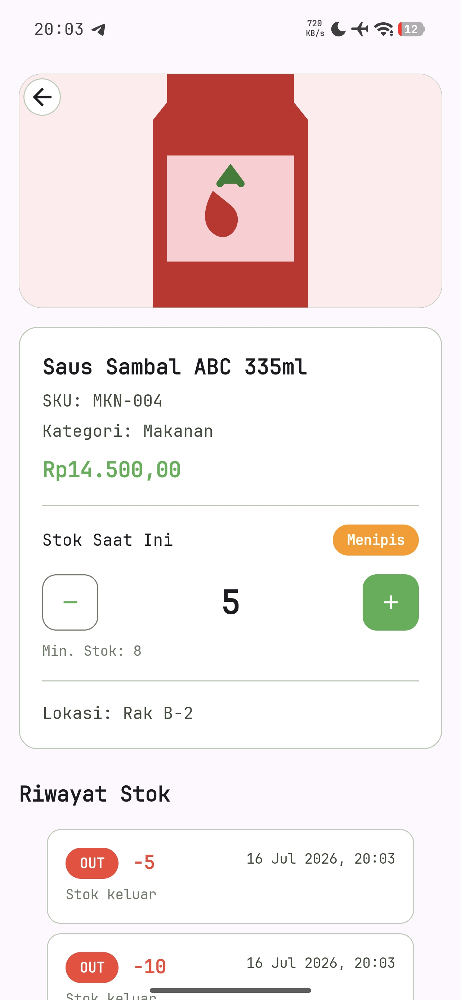</td>
  </tr>
  <tr>
    <td align="center"><b>Detail Produk (Staff)</b></td>
    <td align="center"><b>Tambah Produk</b></td>
    <td align="center"><b>Laporan</b></td>
  </tr>
  <tr>
    <td>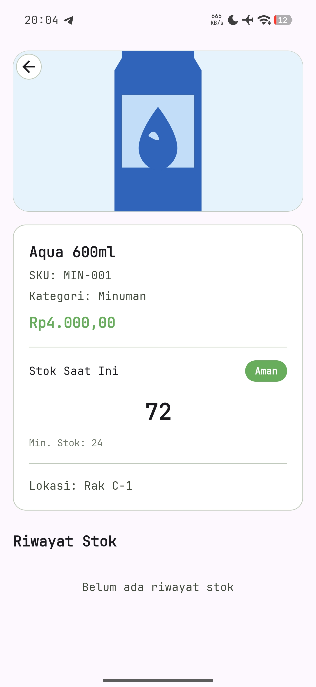</td>
    <td>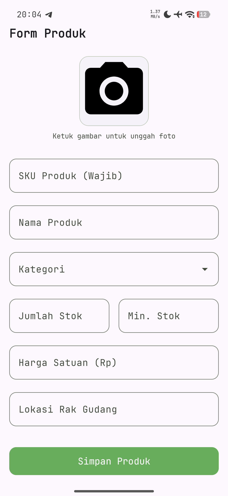</td>
    <td>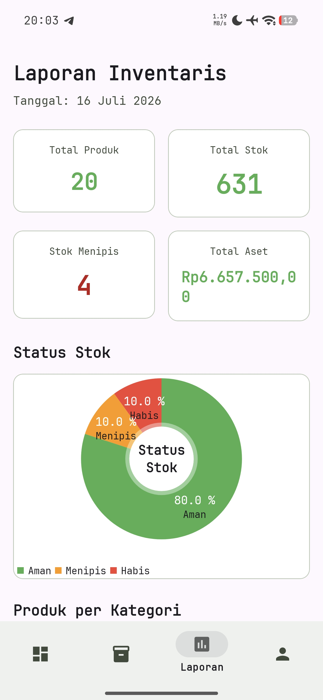</td>
  </tr>
  <tr>
    <td align="center"><b>Export PDF</b></td>
    <td align="center"><b>Export CSV</b></td>
    <td align="center"><b>Profil</b></td>
  </tr>
  <tr>
    <td>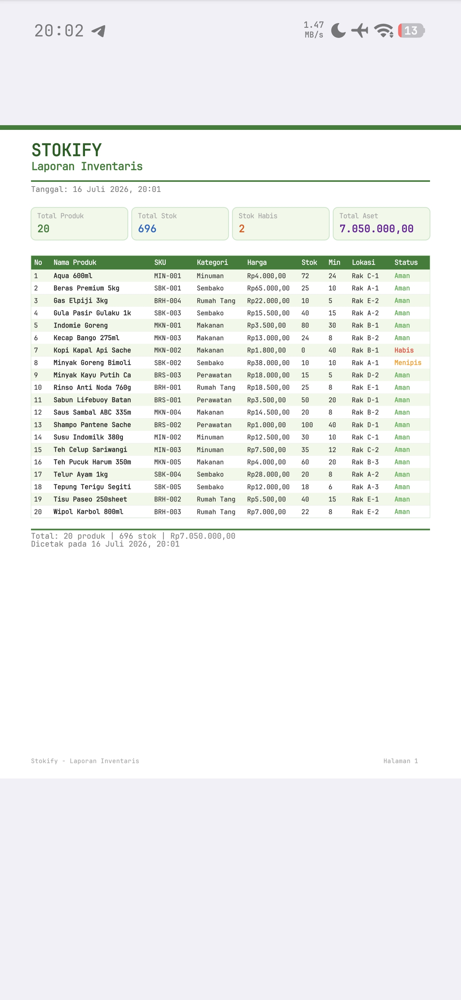</td>
    <td>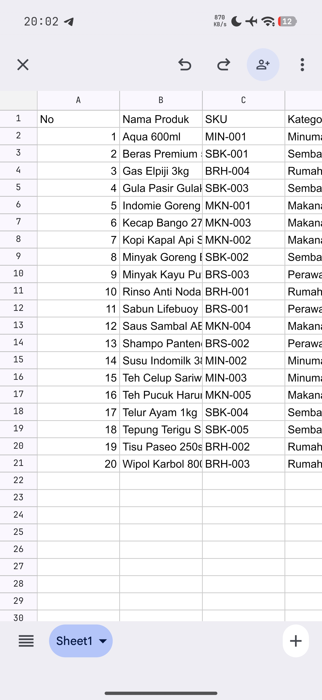</td>
    <td>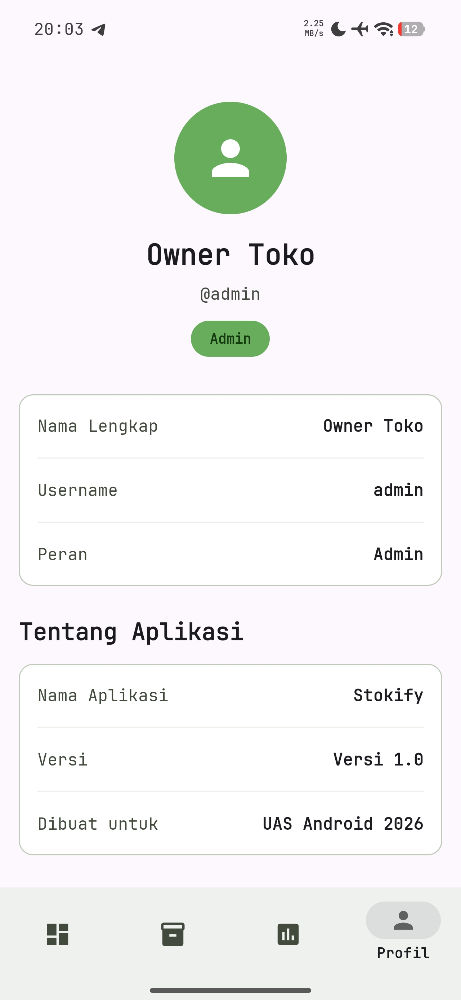</td>
  </tr>
  <tr>
    <td align="center"><b>Dialog Hapus</b></td>
    <td align="center"><b>Dialog Logout</b></td>
    <td align="center"><b>Empty State</b></td>
  </tr>
  <tr>
    <td>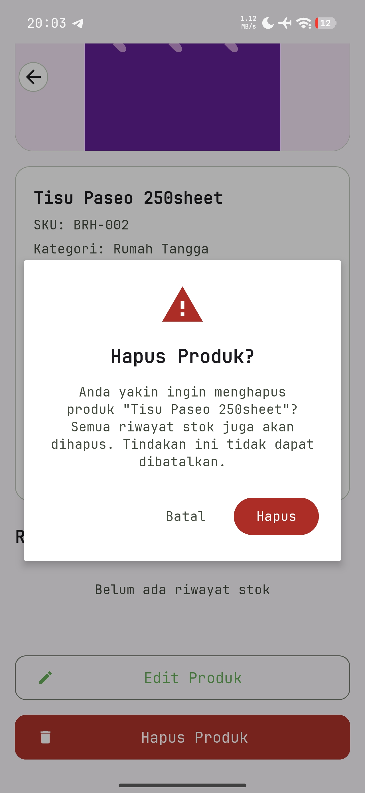</td>
    <td>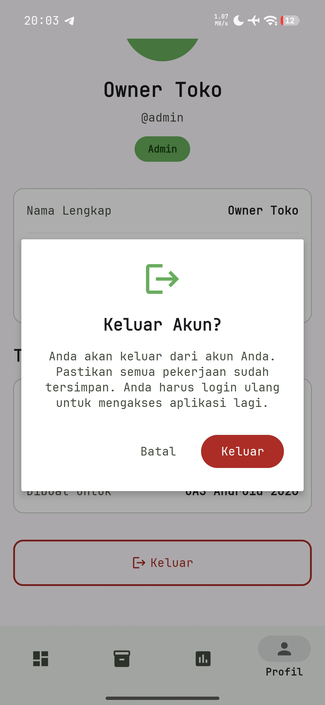</td>
    <td>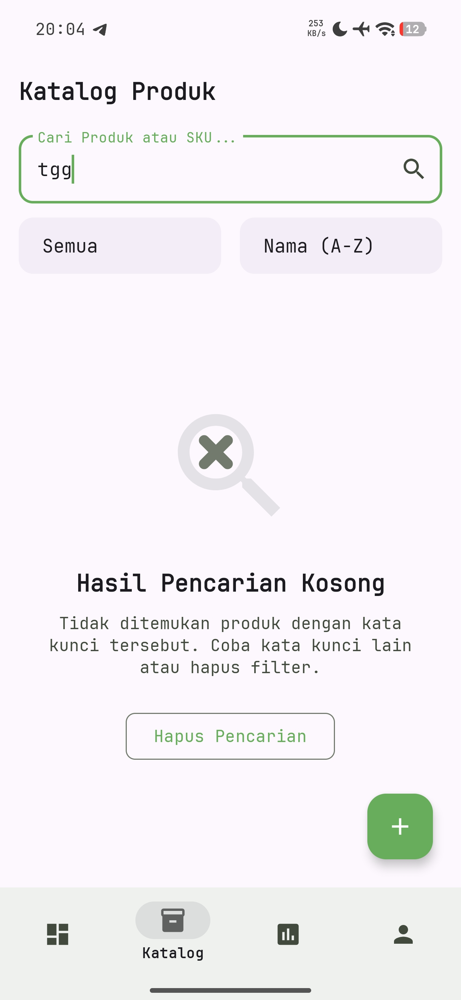</td>
  </tr>
</table>

---

## Cara Install

1. Clone repository
```bash
git clone https://github.com/CallMeJaja/UAS202404021.git
```

2. Buka project di Android Studio

3. Build dan run di device/emulator

### Default User
| Username | Password | Role |
|----------|----------|------|
| admin | admin123 | Admin |
| staff | staff123 | Staff |

---

## Rubrik Penilaian

| Komponen | Bobot | Status |
|----------|-------|--------|
| Room Database (Entity, DAO, CRUD) | 25% | ✅ |
| Arsitektur (Repository, ViewModel, ViewBinding) | 20% | ✅ |
| Fungsionalitas Aplikasi | 20% | ✅ |
| UI/UX dan Material Design | 15% | ✅ |
| Dokumentasi & Presentasi | 10% | 🔄 |
| Kreativitas & Nilai Tambahan | 10% | ✅ |

### Nilai Tambahan yang Diimplementasikan
- ✅ Filter data by kategori
- ✅ Sorting data (nama/harga/stok)
- ✅ Export PDF/CSV
- ✅ Dashboard statistik
- ✅ Multi Role User (Admin/Staff)
- ✅ Dark Theme
- ✅ Git Commit History yang rapi

---

## Tim Pengembang

| Nama | NIM | Peran |
|------|-----|-------|
| [Nama Anggota 1] | [NIM] | [Peran] |
| [Nama Anggota 2] | [NIM] | [Peran] |
| [Nama Anggota 3] | [NIM] | [Peran] |

**Dosen Pengampu**: Musawarman

**Mata Kuliah**: Workshop Pemrograman Android I

**Program Studi**: Teknologi Rekayasa Perangkat Lunak

**Institusi**: Politeknik Enjinering Indorama Eva

**Tahun Akademik**: 2025/2026 (Genap)

---

## Link Penting

- **GitHub Repository**: https://github.com/CallMeJaja/UAS202404021
- **Release APK**: https://github.com/CallMeJaja/UAS202404021/releases/tag/v1.0.0
- **Video Demonstrasi**: [Link Video](https://youtu.be/xxxxx)


